# Geosamples
Geographical representation

# 📋 Diagramme de séquence des différentes fonctions

## Authentication

🟢 /login GET

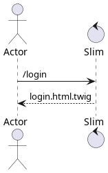

🟠 /login POST

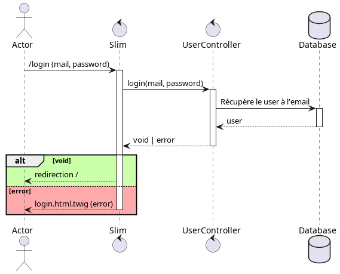

🟢 /signup GET

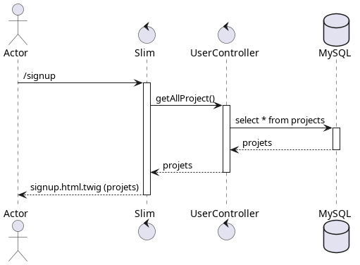

🟠 /signup POST

🟠 /change_password POST

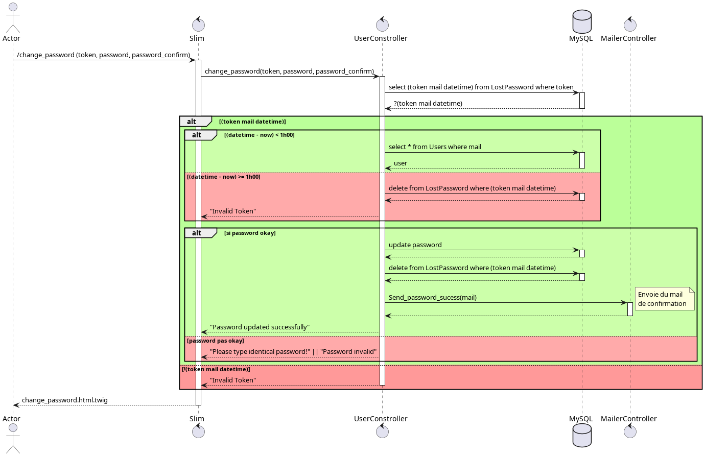

🟠 /resetpassword POST

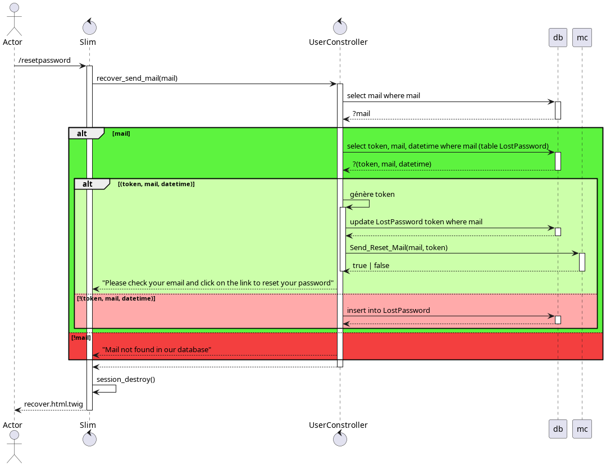

🟢 /recover GET

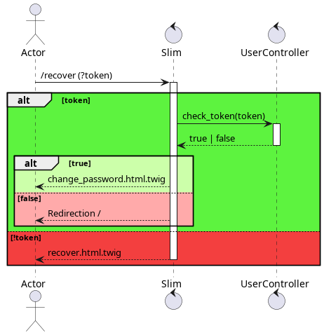

🟠 /recover POST

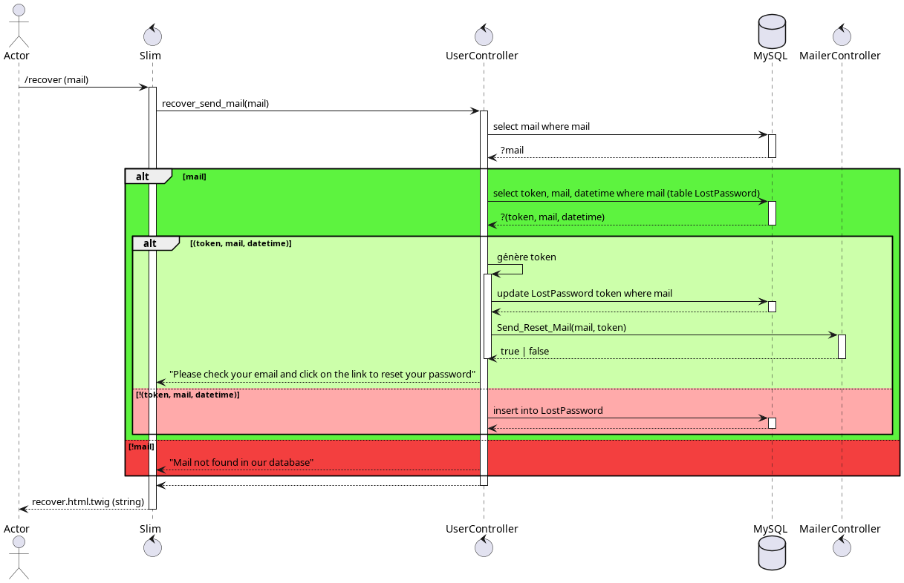

🟢 /logout GET

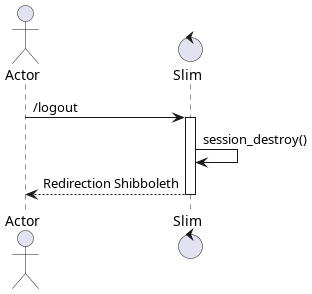

## User handle

🟢 /activate_account GET

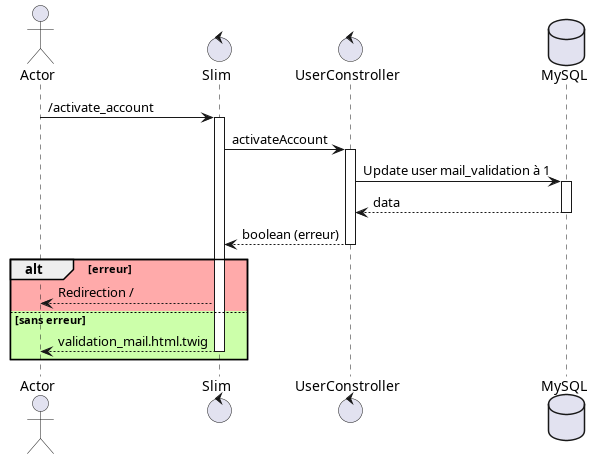

🟠 /approveuser POST

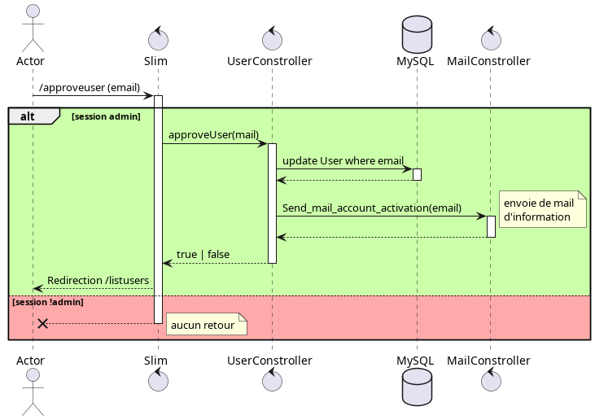

🟠 /disableuser POST

🟠 /removeuser POST

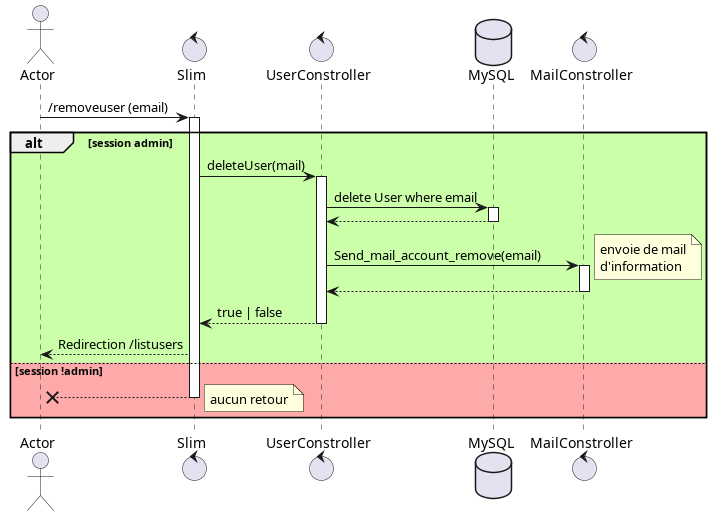

🟠 /add_user_projects POST

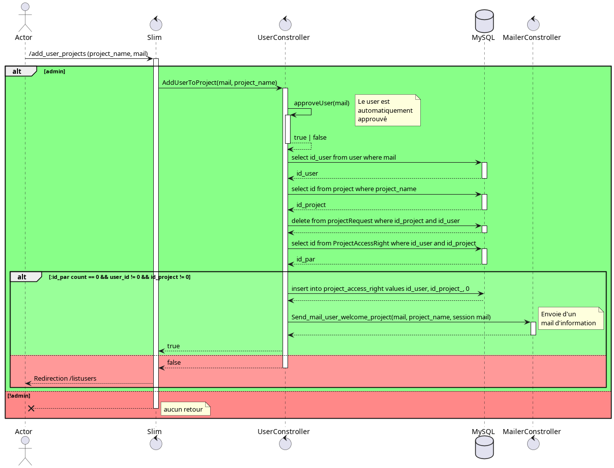

🟠 /delete_user_projects POST

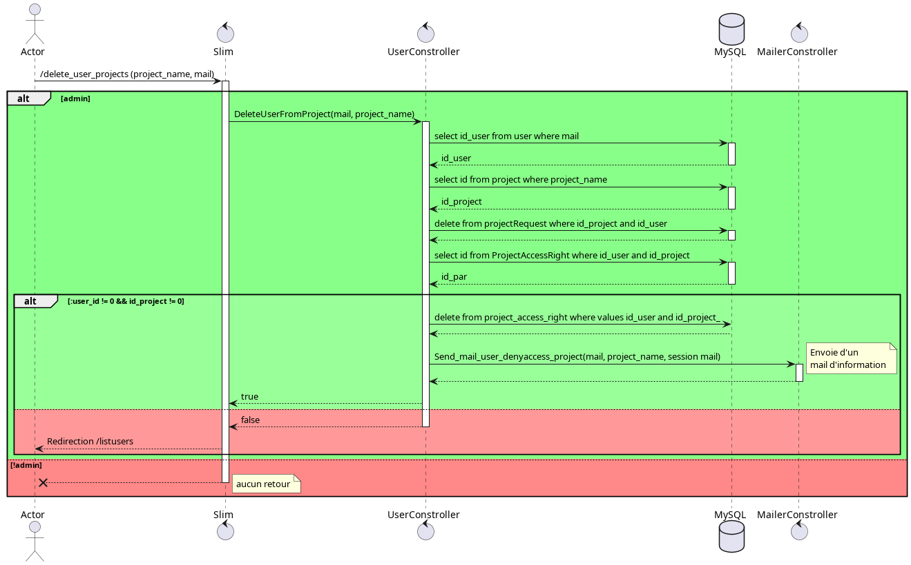

🟠 /modifyuser POST

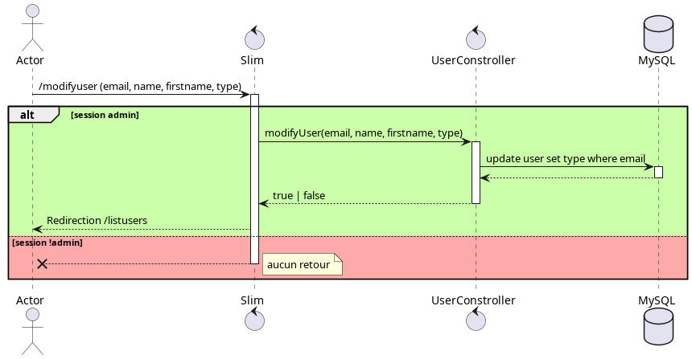

🟢 /listusers GET

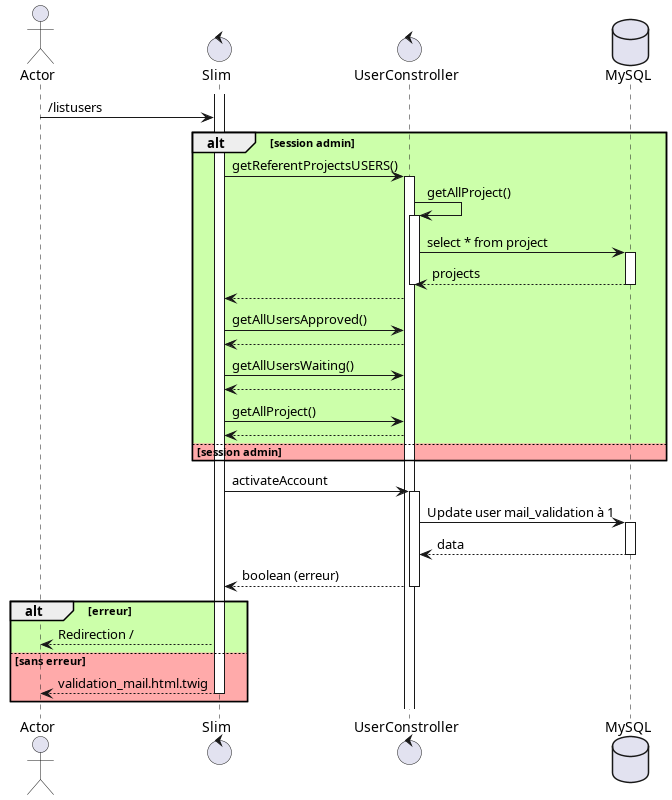

🟢 /myaccount GET

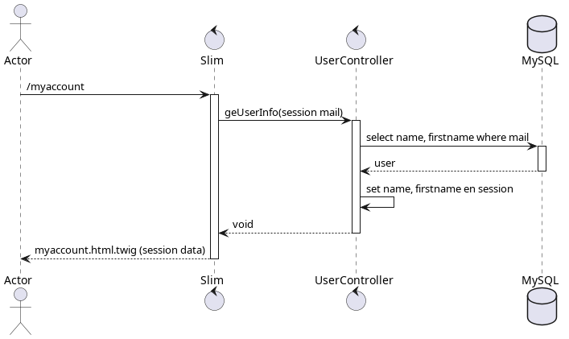

🟠 /myaccount POST

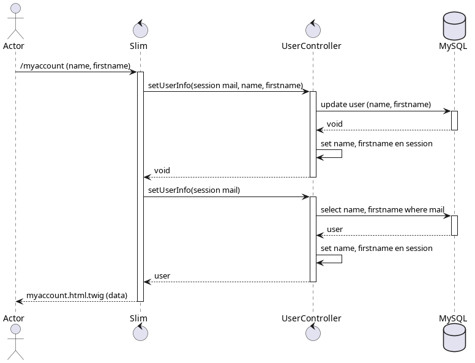

## Elastic Search

🟢 /get_all_poi GET

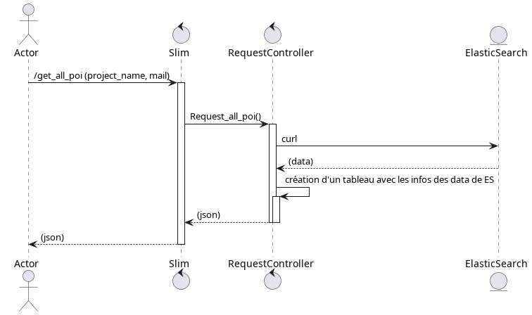

## Autres

🟠 /create_project POST

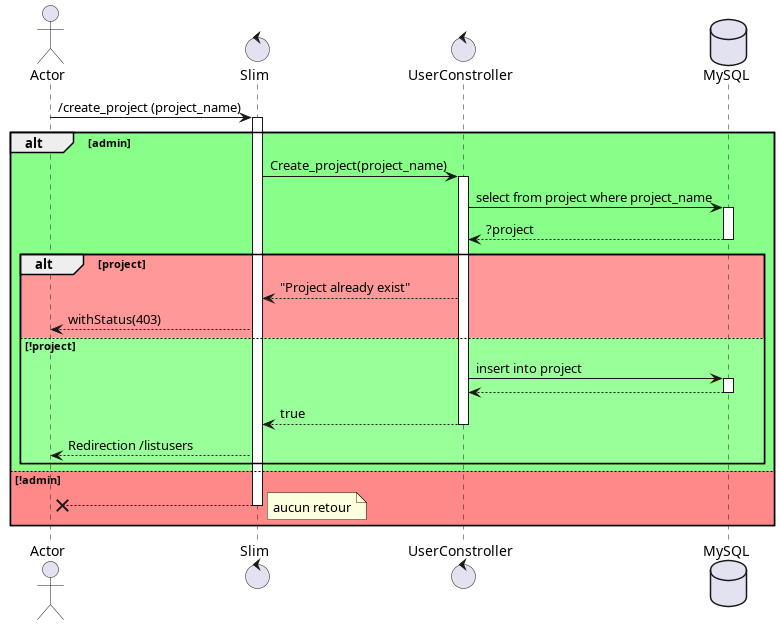

🟠 /contact POST

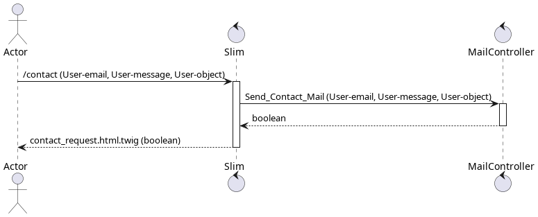

🟢 /terms GET

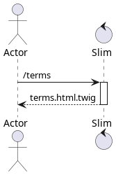

🟢 / GET

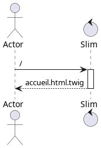